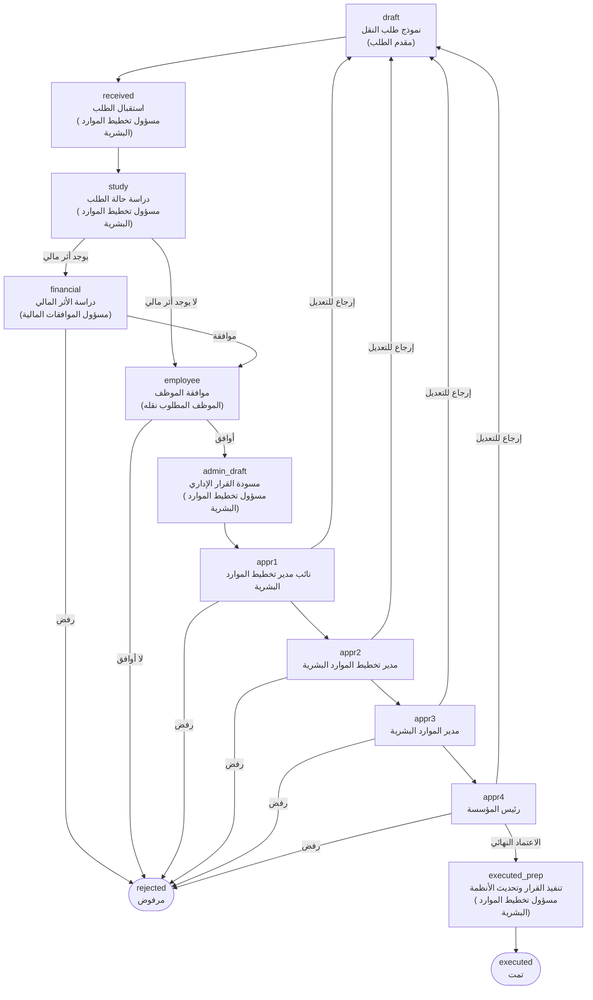

# مسار طلب النقل الوظيفي

يوضح هذا المستند مراحل الطلب كما هي معرّفة في `assets/js/config/form-schemas.js`.

## المخطط

## المراحل

| المعرّف | المرحلة | المسؤول | الانتقال التالي |
|---|---|---|---|
| `draft` | نموذج طلب النقل (يُشترط الموافقة على السياسات أولًا) | مقدم الطلب | `received` |
| `received` | استقبال الطلب | مسؤول تخطيط الموارد البشرية | `study` |
| `study` | دراسة حالة الطلب | مسؤول تخطيط الموارد البشرية | `financial` عند وجود أثر مالي، وإلا `employee` |
| `financial` | دراسة الأثر المالي | مسؤول الموافقات المالية | موافقة ← `employee` / رفض ← `rejected` |
| `employee` | موافقة الموظف على النقل | الموظف المطلوب نقله | موافقة ← `admin_draft` / رفض ← `rejected` |
| `admin_draft` | إعداد مسودة القرار الإداري | مسؤول تخطيط الموارد البشرية | `appr1` |
| `appr1` … `appr4` | سلسلة الاعتماد الإداري | نائب مدير التخطيط ← مدير التخطيط ← مدير الموارد البشرية ← رئيس المؤسسة | اعتماد ← المستوى التالي / رفض ← `rejected` / إرجاع ← `draft` |
| `executed_prep` | تنفيذ القرار وتحديث الأنظمة | مسؤول تخطيط الموارد البشرية | `executed` |
| `executed` | الطلب مكتمل | — | نهائي |
| `rejected` | الطلب مرفوض | — | نهائي |

## قواعد عامة

- لا يظهر نموذج أي خطوة إلا للدور المسؤول عنها، وتعرض بقية الأدوار رسالة "بانتظار إجراء من…".
- الحقول المعلَّمة بـ `required` إلزامية قبل الانتقال.
- الرفض أو الإرجاع في سلسلة الاعتماد يتطلب كتابة ملاحظة.
- عند إكمال كل خطوة تُحفظ لقطة من بياناتها في ملف المعاملة، ويُضاف سطر إلى سجل الإجراءات.
