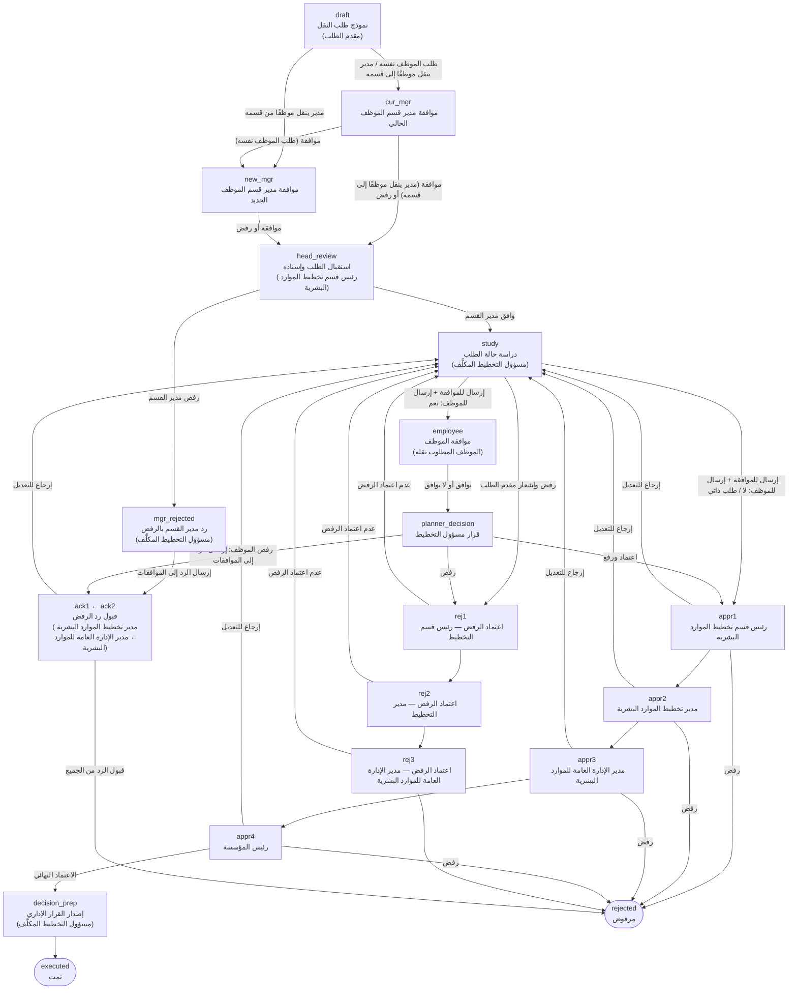

# مسار طلب النقل الوظيفي

يوضح هذا المستند مراحل الطلب كما هي معرّفة في `assets/js/config/form-schemas.js`.

## الصفحة الرئيسية والبوابات

عند فتح النظام تظهر ثلاثة خيارات:

| الخيار | من يستخدمه | ما يظهر |
|---|---|---|
| ١. تقديم طلب ومتابعة طلباتي | مقدم الطلب | إنشاء طلب جديد ومتابعة الطلبات |
| ٢. الدخول كموظف بقسم تخطيط الموارد البشرية | رئيس القسم أو مسؤول التخطيط (خيار فرعي) | جميع طلبات النقل؛ رئيس القسم يُسند، والمسؤول المكلَّف يُكمل الإجراءات |
| ٣. الاطلاع على طلبات الموافقة | مدير القسم الحالي، مدير القسم الجديد، الموظف المطلوب نقله، رئيس قسم التخطيط، مدير التخطيط، مدير الإدارة العامة للموارد البشرية، رئيس المؤسسة | الطلبات التي تنتظر قرار صاحب الدور أو سبق أن بتّ فيها |

في النظام الفعلي تُحدَّد هوية المستخدم ودوره من صلاحيات تسجيل الدخول، وفي هذا النموذج يُحاكى ذلك باختيار الاسم أو الدور من شريط "مسجّل الدخول" أعلى البوابة.

## المخطط

## المراحل

| المعرّف | المرحلة | المسؤول | الانتقال التالي |
|---|---|---|---|
| `draft` | نموذج طلب النقل (يُشترط الموافقة على السياسات أولًا) | مقدم الطلب | طلب الموظف نفسه أو مدير ينقل موظفًا إلى قسمه ← `cur_mgr` / مدير ينقل موظفًا من قسمه ← `new_mgr` |
| `cur_mgr` | موافقة مدير قسم الموظف الحالي | مدير قسم الموظف الحالي | موافقة: طلب الموظف نفسه ← `new_mgr`، وإلا ← `head_review` / رفض ← `head_review` |
| `new_mgr` | موافقة مدير قسم الموظف الجديد | مدير قسم الموظف الجديد | موافقة أو رفض ← `head_review` |
| `head_review` | استقبال الطلب وإسناده لأحد مسؤولي التخطيط الخمسة | رئيس قسم تخطيط الموارد البشرية | `study` |
| `mgr_rejected` | رد مدير القسم بالرفض | مسؤول التخطيط المكلَّف | "إرسال الرد إلى الموافقات" ← `ack1` فقط |
| `study` | دراسة حالة الطلب | مسؤول التخطيط المكلَّف | "إرسال الطلب للموافقة" ← `employee` إذا اختير إرساله للموظف، وإلا `appr1` / "رفض الطلب وإشعار مقدم الطلب" ← `rej1` |
| `employee` | موافقة الموظف (لكل موظف في الطلب) | الموظف المطلوب نقله | `planner_decision` |
| `planner_decision` | مراجعة رد الموظف | مسؤول التخطيط المكلَّف | إذا وافق الموظف: إرسال لتسلسل الموافقات ← `appr1` / رفض ← `rej1`. إذا رفض: "إرسال الرد إلى الموافقات" ← `ack1` فقط |
| `ack1` ، `ack2` | قبول رد الرفض (لا يصل لرئيس قسم التخطيط ولا لرئيس المؤسسة) | مدير تخطيط الموارد البشرية ← مدير الإدارة العامة للموارد البشرية | "قبول الرد" ← التالي ثم `rejected` / "إرجاع للتعديل" ← `study` |
| `appr1` … `appr4` | سلسلة الاعتماد | رئيس قسم تخطيط الموارد البشرية ← مدير تخطيط الموارد البشرية ← مدير الإدارة العامة للموارد البشرية ← رئيس المؤسسة | اعتماد ← التالي / رفض ← `rejected` / إرجاع للتعديل ← `study` |
| `rej1` … `rej3` | اعتماد رفض مسؤول التخطيط | رئيس قسم التخطيط ← مدير التخطيط ← مدير الإدارة العامة للموارد البشرية | اعتماد ← التالي ثم `rejected` / عدم اعتماد ← `study` |
| `decision_prep` | إصدار القرار الإداري المعبّأ تلقائيًا وطباعته | مسؤول التخطيط المكلَّف | `executed` |
| `executed` | الطلب مكتمل | — | نهائي |
| `rejected` | الطلب مرفوض | — | نهائي |

## قواعد عامة

- **بدء الطلب:** الضغط على "طلب جديد" يعرض سياسات النقل مباشرة، ولا يُنشأ الطلب إلا بعد الموافقة عليها. لا يرى مقدم الطلب بطاقة "الإجراء الحالي"، بل نموذج الطلب فقط حين يكون عليه تعبئته أو تعديله.
- **البحث:** يمكن البحث بالرقم الوظيفي أو الاسم عند اختيار الموظف (كتابة الرقم كاملًا تختاره مباشرة)، وفي لوحة الطلبات.
- **صفة مقدّم الطلب:** الموظف نفسه (تُعبّأ بياناته تلقائيًا)، أو مدير قسم ينقل موظفًا من قسمه، أو مدير قسم ينقل موظفًا إلى قسمه. يستطيع المدير نقل أكثر من موظف عبر جدول يقبل اللصق من Excel.
- **موافقة مديري الأقسام:** بعد تقديم الطلب مباشرة. طلب الموظف نفسه يمر على مدير قسمه الحالي ثم مدير القسم الجديد، وطلب المدير لنقل موظف من قسمه يمر على مدير القسم الجديد، وطلب المدير لنقل موظف إلى قسمه يمر على مدير القسم الحالي. الرفض يتطلب ملاحظة، ويُرسل مباشرة لتخطيط الموارد البشرية دون المرور على المدير التالي.
- **بعد قرار المدير:** يُسند رئيس قسم التخطيط الطلب لمسؤول تخطيط. إذا وافق المدير يُكمل المسؤول دراسة الحالة ثم يرسل الطلب للموافقات، وإذا رفض يكون الإجراء الوحيد للمسؤول "إرسال الرد إلى الموافقات".
- **الإرجاع للتعديل:** إذا أرجع أي مستوى في تسلسل الموافقات الطلب (أو لم يعتمد الرفض، أو أرجع رد الرفض)، يعود الطلب لمسؤول التخطيط المكلَّف لتعديل نموذج دراسة الحالة، ولا يعود لمقدم الطلب في أي حال. بعد إعادة الإرسال تبدأ الموافقات من جديد.
- **الإسناد:** خطوات مسؤول التخطيط متاحة فقط للمسؤول الذي أسند إليه رئيس القسم الطلب، ويطّلع بقية المسؤولين عليه دون اتخاذ إجراء. يظهر اسم المسؤول المكلَّف في لوحة الطلبات.
- **موافقة الموظف:** خيار "إرسال الطلب للموظف للموافقة" لا يظهر إذا كان الموظف نفسه مقدّم الطلب. يرى الموظف ملخصًا يوضح البدلات المفقودة والمنطقة والمهام الجديدة، ولا يرى ملف المعاملة ولا سجل الإجراءات.
- **دراسة الحالة:** تنتهي بزرين: "إرسال الطلب للموافقة" (للموظف إن اختير ذلك، وإلا لتسلسل الموافقات مباشرة) و"رفض الطلب وإشعار مقدم الطلب" الذي يكفيه كتابة التوصية.
- **رد الرفض (رفض الموظف أو رفض مدير القسم الحالي/الجديد):** يعود لمسؤول التخطيط، وإجراؤه الوحيد "إرسال الرد إلى الموافقات". يصل الرد لمدير تخطيط الموارد البشرية ثم مدير الإدارة العامة للموارد البشرية (دون رئيس قسم التخطيط ورئيس المؤسسة)، ولكل منهما خياران فقط: "قبول الرد" أو "إرجاع للتعديل". بعد قبول الجميع يُغلق الطلب بالرفض ويُشعَر مقدم الطلب بالسبب.
- **ملف المعاملة:** يعرض النماذج فقط (طلب النقل، دراسة الحالة، موافقة الموظف) بأحدث نسخة منها، والقرار الإداري بعد صدوره. بقية الإجراءات (الإسناد، الاعتمادات، الإرجاع، الرفض وملاحظاتها) تظهر في سجل الإجراءات.
- **عرض الطلب:** لا تظهر تفاصيل الطلب إلا عند الضغط على صفه في جدول الطلبات، والضغط مرة أخرى يخفيها.
- **سجل الإجراءات:** كل إجراء مكتمل عنوانه اسم الإجراء وتحته من نفّذه ووقته وملاحظاته، وفي آخر السجل الإجراء التالي بعنوان ودائرة باللون الرصاصي.
- **الرفض:** رفض مسؤول التخطيط يحتاج إلى اعتماد رئيس قسم التخطيط ثم المدير ثم مدير الإدارة العامة للموارد البشرية، ولا يصل لرئيس المؤسسة. يرى مقدم الطلب عند الرفض التوصية (سبب الرفض) فقط.
- **الأثر المالي:** سؤال للتوثيق فقط، ولا يترتب عليه أي مسار.
- الحقول المعلَّمة بـ `required` إلزامية، والرفض أو الإرجاع في سلسلة الاعتماد يتطلب كتابة ملاحظة.
