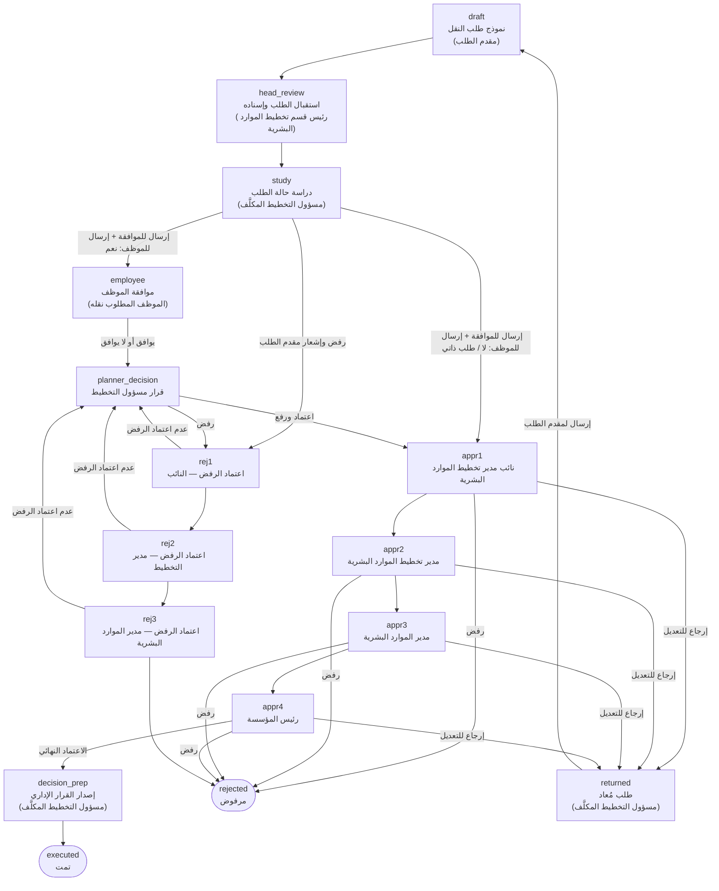

# مسار طلب النقل الوظيفي

يوضح هذا المستند مراحل الطلب كما هي معرّفة في `assets/js/config/form-schemas.js`.

## المخطط

## المراحل

| المعرّف | المرحلة | المسؤول | الانتقال التالي |
|---|---|---|---|
| `draft` | نموذج طلب النقل (يُشترط الموافقة على السياسات أولًا) | مقدم الطلب | `head_review` |
| `head_review` | استقبال الطلب وإسناده لأحد مسؤولي التخطيط الخمسة | رئيس قسم تخطيط الموارد البشرية | `study` |
| `study` | دراسة حالة الطلب | مسؤول التخطيط المكلَّف | "إرسال الطلب للموافقة" ← `employee` إذا اختير إرساله للموظف، وإلا `appr1` / "رفض الطلب وإشعار مقدم الطلب" ← `rej1` |
| `employee` | موافقة الموظف (لكل موظف في الطلب) | الموظف المطلوب نقله | `planner_decision` |
| `planner_decision` | مراجعة رد الموظف | مسؤول التخطيط المكلَّف | إرسال لتسلسل الموافقات ← `appr1` / رفض ← `rej1` |
| `appr1` … `appr4` | سلسلة الاعتماد | النائب ← مدير التخطيط ← مدير الموارد البشرية ← رئيس المؤسسة | اعتماد ← التالي / رفض ← `rejected` / إرجاع ← `returned` |
| `rej1` … `rej3` | اعتماد رفض مسؤول التخطيط | النائب ← مدير التخطيط ← مدير الموارد البشرية | اعتماد ← التالي ثم `rejected` / عدم اعتماد ← `planner_decision` |
| `returned` | طلب مُعاد من سلسلة الاعتماد | مسؤول التخطيط المكلَّف | `draft` (يعدّله مقدم الطلب ويعيد تقديمه بنفس الخطوات) |
| `decision_prep` | إصدار القرار الإداري المعبّأ تلقائيًا وطباعته | مسؤول التخطيط المكلَّف | `executed` |
| `executed` | الطلب مكتمل | — | نهائي |
| `rejected` | الطلب مرفوض | — | نهائي |

## قواعد عامة

- **بدء الطلب:** الضغط على "طلب جديد" يعرض سياسات النقل مباشرة، ولا يُنشأ الطلب إلا بعد الموافقة عليها. لا يرى مقدم الطلب بطاقة "الإجراء الحالي"، بل نموذج الطلب فقط حين يكون عليه تعبئته أو تعديله.
- **صفة مقدّم الطلب:** الموظف نفسه (تُعبّأ بياناته تلقائيًا)، أو مدير قسم ينقل موظفًا من قسمه، أو مدير قسم ينقل موظفًا إلى قسمه. يستطيع المدير نقل أكثر من موظف عبر جدول يقبل اللصق من Excel.
- **الإسناد:** خطوات مسؤول التخطيط متاحة فقط للمسؤول الذي أسند إليه رئيس القسم الطلب، ويطّلع بقية المسؤولين عليه دون اتخاذ إجراء. يظهر اسم المسؤول المكلَّف في لوحة الطلبات.
- **موافقة الموظف:** خيار "إرسال الطلب للموظف للموافقة" لا يظهر إذا كان الموظف نفسه مقدّم الطلب. يرى الموظف ملخصًا يوضح البدلات المفقودة والمنطقة والمهام الجديدة، ولا يرى ملف المعاملة ولا سجل الإجراءات.
- **دراسة الحالة:** تنتهي بزرين: "إرسال الطلب للموافقة" (للموظف إن اختير ذلك، وإلا لتسلسل الموافقات مباشرة) و"رفض الطلب وإشعار مقدم الطلب" الذي يكفيه كتابة التوصية.
- **الرفض:** رفض مسؤول التخطيط يحتاج إلى اعتماد النائب ثم المدير ثم مدير الموارد البشرية، ولا يصل لرئيس المؤسسة. يرى مقدم الطلب عند الرفض التوصية (سبب الرفض) فقط.
- **الإرجاع للتعديل:** يصل أولًا لمسؤول التخطيط، ثم يرسله لمقدم الطلب، فيعدّله ويعيد تقديمه ويمر بنفس الخطوات من جديد.
- **الأثر المالي:** سؤال للتوثيق فقط، ولا يترتب عليه أي مسار.
- الحقول المعلَّمة بـ `required` إلزامية، والرفض أو الإرجاع في سلسلة الاعتماد يتطلب كتابة ملاحظة.
